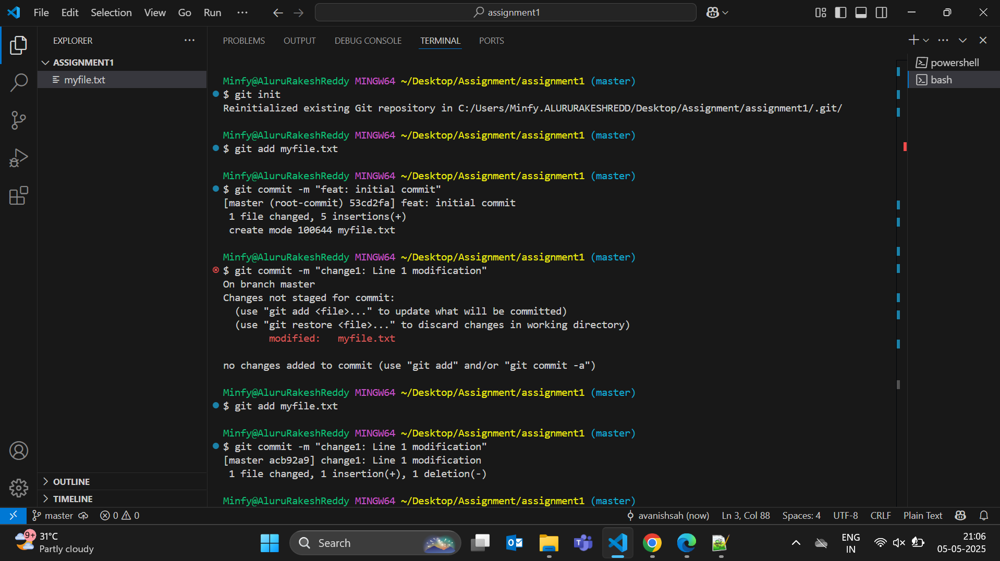
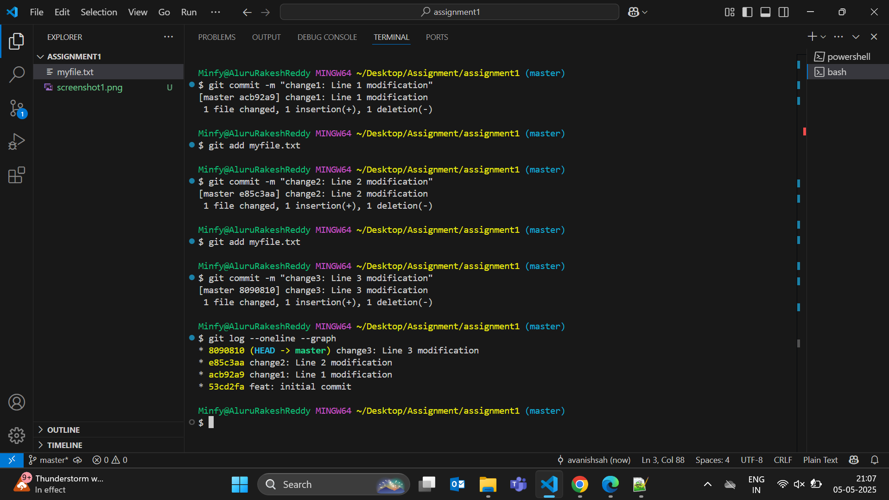

# Assignment 1: Basic Git Workflow

## Deliverables

### 1. Repository Commit History
[View all files in repository](./)

### 2. Git Log Screenshot


### 3. Changes Explanation

| Commit Hash | Message                     | Changes Made                                                                 |
|-------------|-----------------------------|-----------------------------------------------------------------------------|
| 53cd2fa     | feat: initial commit        | Created base file with 5 lines of personal introduction and assignment info |
| acb92a9     | change1: Line 1 modification| Expanded Line 1 with hometown details: `+ and I'm from Bihar`              |
| e85c3aa     | change2: Line 2 modification| Added graduation timeline: `+ and going to graduate in May 2025`           |
| 8090810     | change3: Line 3 modification| Included career plans: `+ and looking forward for full time employment`     |

### 4. Commit Differences Example


## Detailed Change Breakdown

**Initial Commit (53cd2fa)**
```text
Original content:
Line 1: Hey, I'm Avanish Kumar
Line 2: I'm a student at SRM IST, Ramapuram
Line 3: Currently interning at Minfy Technologies
Line 4: I've got an assignment on Git fundamentals
Line 5: It's divided into Easy, Medium, and Hard levels

First Modification (acb92a9)
- Line 1: Hey, I'm Avanish Kumar
+ Line 1: Hey, I'm Avanish Kumar and I'm from Bihar

Second Modification (e85c3aa)
- Line 2: I'm a student at SRM IST, Ramapuram
+ Line 2: I'm a student at SRM IST, Ramapuram and going to graduate in May 2025

Third Modification (8090810)
- Line 3: Currently interning at Minfy Technologies
+ Line 3: Currently interning at Minfy Technologies and looking forward for full time employment\n## Assignment 2 Completion\n- [x] Created GitHub repository\n- [x] Resolved file conflicts\n- [x] Implemented branch workflow
